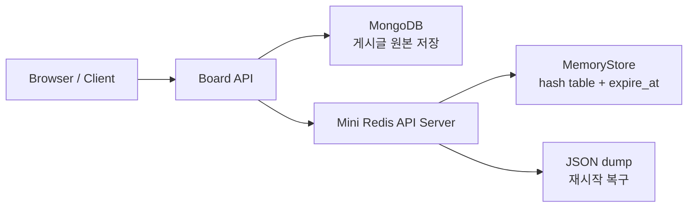

# Mini Redis Board

## 1. Mini Redis와 게시판 웹

이 프로젝트는 게시글 원본 데이터는 MongoDB에 저장하고, 세션·조회수·게시글 캐시·인기글 캐시는 Mini Redis에 저장하는 게시판 웹 서비스이다.  
영속성이 필요한 데이터와 빠른 재사용이 필요한 데이터를 분리해, DB와 캐시의 역할 차이를 한 프로젝트 안에서 확인할 수 있도록 구성했다.

Mini Redis는 단순한 내부 자료구조가 아니라 별도 API 서버로 분리된 key-value 저장소이다.  
게시판 서비스는 이 저장소를 HTTP로 호출하며, 이를 통해 외부 재사용이 가능한 구조와 캐시 시스템의 기본 동작을 함께 다룬다.

## 2. 시스템 아키텍처

- Board API: 게시글 CRUD, 세션 처리, 캐시 활용 로직 담당
- MongoDB: 게시글 본문과 같은 영속 데이터 저장
- Mini Redis: 캐시, 세션, 조회수 카운터를 메모리 기반으로 처리
- JSON dump: Mini Redis 상태를 파일로 저장하고 재시작 시 복구

## 3. 주요 쟁점

### 3-1. 해시테이블 구조로 Mini Redis 접근 시간 줄임

Mini Redis의 메모리 저장소는 Python `dict` 기반 해시테이블로 구현했다.  
key 기준 조회는 평균적으로 `O(1)`에 가깝기 때문에, 세션 확인이나 게시글 캐시 조회처럼 반복되는 접근을 빠르게 처리할 수 있다.

### 3-2. 동시성 문제를 방지하기 위해 고려한 점

Mini Redis 내부의 `store`와 `expire_at`은 `RLock`으로 보호해 동시에 여러 요청이 들어와도 상태가 깨지지 않도록 했다.  
MongoDB 쪽은 unique index와 원자적 업데이트를 사용해 게시글 ID와 카운터 값의 정합성을 분리해서 보장한다.

### 3-3. 보관 기간이 만료된 값을 요청받았을 때 이를 처리하기 위한 방안

TTL이 있는 값은 만료 시간을 함께 저장하고, 값을 읽거나 확인할 때 먼저 만료 여부를 검사한다.  
만료된 값은 즉시 제거하고 없는 값처럼 처리하는 lazy expiration 방식을 사용해, 별도의 주기 작업 없이도 만료 상태를 요청 흐름 안에서 반영한다.

### 3-4. 외부에서도 Mini Redis를 쉽게 사용할 수 있도록 API 형태 구조 설계

Mini Redis는 별도 FastAPI 서버로 분리되어 있으며, Board API는 이를 HTTP로 호출한다.  
이 구조는 게시판 내부 캐시에 머무르지 않고, 다른 서비스나 클라이언트도 같은 방식으로 Mini Redis를 사용할 수 있게 한다.

### 3-5. Redis 서버가 다운되는 상황에서도 보관 중인 데이터를 안전하게 유지하기 위한 방식

Mini Redis는 메모리 기반이지만 현재 상태를 JSON dump 파일로 저장하고, 서버 시작 시 이를 다시 읽어 복구한다.  
완전한 운영 환경용 지속성 전략은 아니지만, 학습 및 데모 환경에서는 세션·캐시·카운터 데이터를 유지하기 위한 단순하고 현실적인 방식이다.

## 4. 품질

### 단위 테스트

저장, 조회, 삭제, TTL, 캐시 무효화 같은 핵심 동작은 테스트와 검증 코드로 확인할 수 있도록 분리된 구조를 갖는다.  
특히 key-value 저장소와 게시판 서비스 로직이 분리되어 있어, 기능별 검증 대상을 나누기 쉬운 형태로 구성되어 있다.

### 엣지 케이스

없는 키 조회, 만료된 세션 재사용, 잘못된 TTL, 정수가 아닌 값에 대한 증가 요청 등 예외 상황을 주요 검토 대상으로 삼았다.  
정상 흐름뿐 아니라 비어 있는 상태, 만료 직후 상태, 잘못된 입력에서도 시스템이 안전하게 동작하는지를 확인하는 데 초점을 두었다.

### 레디스 사용했을 때와 하지 않았을 때의 비교

이 프로젝트는 DB만 읽는 경우와 cache hit가 발생하는 경우를 비교해 성능 차이를 확인할 수 있도록 구성되어 있다.  
반복 요청에서는 Redis 기반 접근이 유리하지만, 실제 체감 성능은 조회 이후의 추가 작업량까지 함께 고려해야 한다는 점도 함께 확인할 수 있다.
