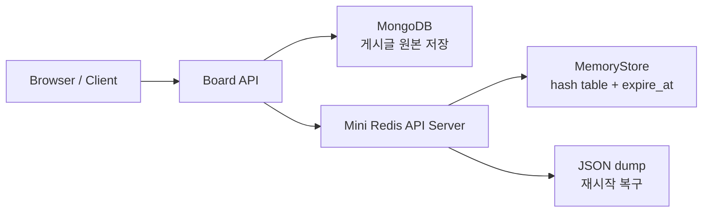

# Mini Redis Board

## 1. Mini Redis와 게시판 웹

우리 팀은 게시글 원본 데이터는 MongoDB에 저장하고, 세션·조회수·게시글 캐시·인기글 캐시는 Mini Redis에 저장하는 게시판 웹 서비스를 구현했다.  
영속성이 필요한 데이터와 빠른 재사용이 필요한 데이터를 분리해서, DB와 캐시가 각각 어떤 역할을 맡아야 하는지 한 프로젝트 안에서 드러나도록 구성했다.

Mini Redis는 단순한 내부 자료구조로 두지 않고, 별도 API 서버로 분리된 key-value 저장소 형태로 만들었다.  
게시판 서비스는 이 저장소를 HTTP로 호출하도록 연결했고, 이를 통해 외부 재사용이 가능한 구조와 캐시 시스템의 기본 동작을 함께 확인할 수 있도록 했다.

## 2. 시스템 아키텍처

- Board API: 게시글 CRUD, 세션 처리, 캐시 활용 로직을 담당하도록 구성했다.
- MongoDB: 게시글 본문과 같은 영속 데이터를 저장하도록 사용했다.
- Mini Redis: 캐시, 세션, 조회수 카운터를 메모리 기반으로 처리하도록 분리했다.
- JSON dump: Mini Redis 상태를 파일로 저장하고 재시작 시 복구할 수 있게 연결했다.

## 3. 주요 쟁점

### 3-1. 해시테이블 구조로 Mini Redis 접근 시간 줄임

Mini Redis의 메모리 저장소는 Python `dict` 기반 해시테이블로 구현했다.  
이 구조를 선택해서 key 기준 탐색을 평균적으로 `O(1)`에 가깝게 가져가려 했고, 실제로 세션 확인이나 게시글 캐시 조회처럼 반복되는 접근을 단순한 구조로 빠르게 처리할 수 있게 만들었다.

### 3-2. 동시성 문제를 방지하기 위해 고려한 점

Mini Redis 내부의 `store`와 `expire_at`은 `RLock`으로 보호해 동시에 여러 요청이 들어와도 상태가 깨지지 않도록 처리했다.  
MongoDB 쪽은 unique index와 원자적 업데이트를 사용해 게시글 ID와 카운터 값의 정합성을 별도로 보장하도록 구성했고, 메모리 저장소와 영속 저장소의 동시성 문제를 각각 다른 방식으로 다뤘다.

### 3-3. 보관 기간이 만료된 값을 요청받았을 때 이를 처리하기 위한 방안

TTL이 있는 값은 만료 시간을 함께 저장하고, 값을 읽거나 확인할 때 먼저 만료 여부를 검사하도록 구현했다.  
이미 만료된 값은 즉시 제거하고 없는 값처럼 응답하는 lazy expiration 방식을 적용해서, 별도의 주기 작업 없이도 실제 요청 흐름 안에서 만료 상태가 반영되도록 처리했다.

### 3-4. 외부에서도 Mini Redis를 쉽게 사용할 수 있도록 API 형태 구조 설계

Mini Redis는 별도 FastAPI 서버로 분리했고, Board API는 이를 HTTP로 호출하도록 연결했다.  
이 구조를 통해 게시판 내부 캐시로만 끝나지 않고, 다른 서비스나 외부 클라이언트도 같은 방식으로 Mini Redis를 사용할 수 있는 형태를 만들었다.

### 3-5. Redis 서버가 다운되는 상황에서도 보관 중인 데이터를 안전하게 유지하기 위한 방식

Mini Redis는 메모리 기반이지만 현재 상태를 JSON dump 파일로 저장하고, 서버 시작 시 이를 다시 읽어 복구하도록 구현했다.  
완전한 운영 환경용 지속성 전략까지는 아니지만, 학습 및 데모 환경에서는 세션·캐시·카운터 데이터를 최대한 유지하기 위한 단순하고 현실적인 복구 방식으로 정리했다.

## 4. 품질

### 단위 테스트

저장, 조회, 삭제, TTL, 캐시 무효화 같은 핵심 동작은 테스트와 검증 코드로 확인할 수 있도록 구조를 분리했다.  
특히 key-value 저장소와 게시판 서비스 로직을 나눠 두어서, 기능별로 테스트 대상을 구분해 확인하기 쉬운 형태로 정리했고 핵심 흐름이 의도대로 동작하는 것을 검증했다.

### 엣지 케이스

없는 키 조회, 만료된 세션 재사용, 잘못된 TTL, 정수가 아닌 값에 대한 증가 요청 등 예외 상황을 주요 검토 대상으로 잡고 확인했다.  
정상 흐름만 보는 대신 비어 있는 상태, 만료 직후 상태, 잘못된 입력에서도 시스템이 안전하게 동작하는지까지 함께 점검했다.

### 레디스 사용했을 때와 하지 않았을 때의 비교

이 프로젝트에서는 DB만 읽는 경우와 cache hit가 발생하는 경우를 비교해 성능 차이를 확인할 수 있게 구성했다.  
반복 요청에서는 Redis 기반 접근이 더 유리하다는 점을 확인했고, 동시에 실제 체감 성능은 조회 이후의 추가 작업량까지 함께 봐야 한다는 점도 같이 정리했다.
